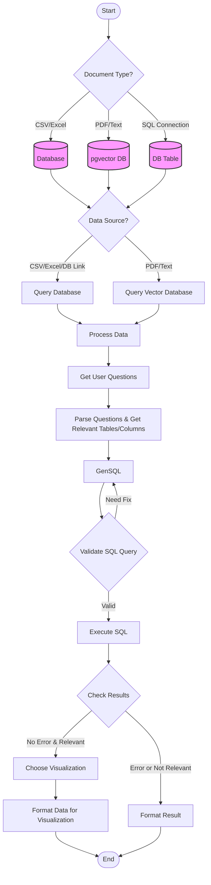
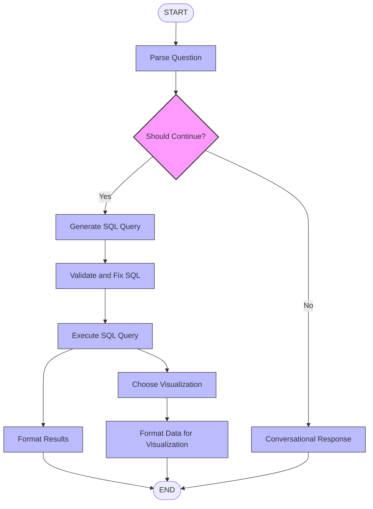
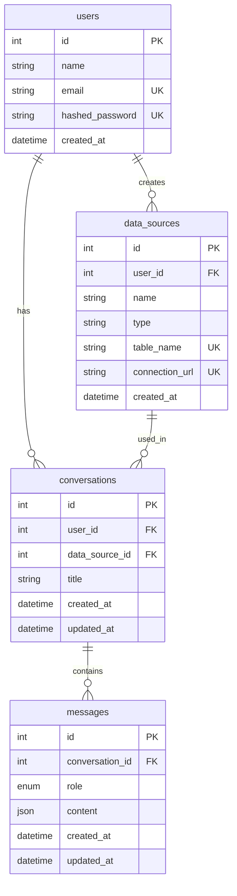

<div align="center">
  <h1>
    <b>LUMIN</b>
  </h1>
</div>

LUMIN is an intelligent data analysis platform that transforms how you interact with your data. Using LLM, LUMIN enables you to ask analytical questions about your data in plain English and receive insights through beautiful visualizations and clear explanations.

## 🚀 Quick Start

### Prerequisites

- Docker & Docker Compose
- Git

### Clone Project

```bash
# Clone the repository
git clone https://github.com/spandan114/LuminAI-Data-Analyst.git
cd lumin_ai

```
### 🔐 Environment Setup

1. Navigate to the backend directory and create your environment file:
```bash
cd backend
cp .env.example .env
```

2. Configure the following environment variables in your `.env` file:

| Variable | Description | Example |
|----------|-------------|---------|
| `OPENAI_API_KEY` | Your OpenAI API key for ChatGPT integration | "sk-..." |
| `GROQ_API_KEY` | Your Groq API key for Groq LLM integration | "gsk-..." |
| `SECRET_KEY` | Secret key for JWT token encryption | "your-secret-key" |
| `DATABASE_URL` | PostgreSQL connection URL | "postgresql://lumin:root@db:5432/lumin" |
| `LANGCHAIN_PROJECT` | Project name for LangChain tracking (optional) | "lumin" |
| `HF_TOKEN` | Hugging Face API token for model access | "hf_..." |

### Notes:
- For local development using Docker, keep the `DATABASE_URL` as is - Docker Compose will handle the connection
- The project uses Groq as the primary LLM provider - a Groq API key is required for full functionality
- `SECRET_KEY` should be a secure random string in production
- While the codebase supports OpenAI and Hugging Face as alternative LLM providers, they are optional, you can configure the methods to use different llm provider
- Default database credentials can be modified in the `docker-compose.yml` file

### Getting API Keys:
- OpenAI API: https://platform.openai.com/
- Groq API: https://console.groq.com/
- Hugging Face: https://huggingface.co/settings/tokens

### Start Container
```bash
# Start the containers
docker compose up --build
```

## 🔌 Local Development URLs

After starting the container, you can access:

| Service | URL | Description |
|---------|-----|-------------|
| Frontend | `http://localhost:3000` | React application interface |
| Backend | `http://localhost:8000` | FastAPI server |
| API Docs | `http://localhost:8000/docs` | Swagger API documentation |

### Remove Container

```bash
# Stop and remove containers
docker compose down
```

## ⚡ Features

- 📂 Universal Data Connection: Seamlessly connect with multiple data sources:

    - CSV and Excel files
    - SQL Databases
    - PDF Documents (API Not integrated yet)
    - Text Files (API Not integrated yet)

- 🧠 Multiple LLM Support: Choose your preferred AI engine:

    - OpenAI (ChatGPT)
    - Groq
    - Hugging Face Models
    - Ollama (Self-hosted)
    - Easy to extend with new LLM providers

- 🤖 Natural Language Processing: Ask questions in plain English about your data
- 💾 Database Support:
    - Full support for tabular databases
    - NoSQL databases not currently supported
- 📊 Smart Visualizations: Automatically generates relevant charts and graphs

- 🔍 Intelligent Analysis: Provides deep insights and patterns in your data


## 🛠️ Tech Stack

### Frontend Modules

| Module | Description |
|--------|-------------|
| `@tanstack/react-query` | Powerful data synchronization for React |
| `chart.js` & `react-chartjs-2` | Rich data visualization library with React components |
| `react-hook-form` | Performant forms with easy validation |
| `react-router-dom` | Declarative routing for React applications |
| `react-toastify` | Toast notifications made easy |
| `recharts` | Composable charting library for React |
| `zustand` | Lightweight state management solution |
| `prismjs` | Syntax highlighting for code blocks |
| `axios` | Promise-based HTTP client |

### Backend Modules

| Module | Description |
|--------|-------------|
| `fastapi` | Modern, fast web framework for building APIs |
| `langchain` | Framework for developing LLM powered applications |
| `langgraph` | State management for LLM application workflows |
| `langchain-openai` | OpenAI integration for LangChain |
| `sqlalchemy` | SQL toolkit and ORM |
| `pgvector` | Vector similarity search for PostgreSQL |
| `pydantic` | Data validation using Python type annotations |
| `alembic` | Database migration tool |
| `pandas` | Data manipulation and analysis library |
| `passlib` | Password hashing library |
| `python-multipart` | Streaming multipart parser for Python |

### Development Tools

| Tool | Purpose |
|------|---------|
| `vite` | Next generation frontend tooling |
| `typescript` | JavaScript with syntax for types |
| `tailwindcss` | Utility-first CSS framework |
| `eslint` & `prettier` | Code linting and formatting |
| `autopep8` | Python code formatter |


## 🔄 Workflow Architecture

### High level flow


### Lang graph flow



## Database Schema 


## 🤝 Contributing

1. Fork the repository
2. Create your feature branch (`git checkout -b feature_name`)
3. Commit your changes (`git commit -m 'Add some comment'`)
4. Push to the branch (`git push origin feature_name`)
5. Open a Pull Request

### Features You Can Contribute
We welcome contributions! Here are some exciting features you can help implement:

**💭 Contextual Chat Enhancement:**
*Status:* Needs Implementation

- Implement context retrieval system
- Integrate pgvector for similarity search
- Add relevance scoring for context selection
- Create context window management
- Add context visualization for users

**📑 Document Analysis Integration:**
*Status:* Backend Ready, Needs Frontend Implementation
- Add functionality to upload PDF or Text document
- Integrate PDF and Text file analysis in the frontend

**💾 Implement NoSQL Database Support**
*Status:* Needs Implementation
- Add MongoDB integration for for analysis
- Implement schema-less data handling
- Add support for nested JSON structures

**⚙️ User Settings Dashboard:**
*Status:* Needs Implementation

- Profile management interface
- Password change workflow with validation
- Email update with verification
- LLM platform selection with configuration
- Model selection based on chosen platform

## Testing Dataset

In the project Demo i used the [Brazilian E-commerce Public Dataset by Olist](https://www.kaggle.com/datasets/olistbr/brazilian-ecommerce), available on Kaggle. The dataset includes information about:

- Customer and orders
- Order items and payments
- Product details
- Seller information
- Geolocation data
- Order reviews
- Product category translations

### Data Loading

The following code demonstrates how to load the Olist dataset into a SQLite database:

1. Download the dataset from [Kaggle](https://www.kaggle.com/datasets/olistbr/brazilian-ecommerce)
2. Extract the files to an `/ecommerce` directory
3. Run the data loading script to create and populate the SQLite database

```python
import os
import pandas as pd
from sqlalchemy import create_engine

def insert_data_to_sqlite(file_path):
    # Extract the file name without extension to use as table name
    file_name = os.path.splitext(os.path.basename(file_path))[0]

    # Read the data (change this to pd.read_excel() for Excel files)
    data = pd.read_csv(file_path)

    # Create a SQLite database (or connect if it already exists)
    engine = create_engine('sqlite:///lumin.db')

    # Insert data into the SQLite database with the table name as the file name
    data.to_sql(file_name, con=engine, if_exists='replace', index=False)
    print(
        f"Data from {file_path} has been inserted into the '{file_name}' table in the 'lumin.db' database.")

# List of dataset files
ecom_data = [
    "olist_customers_dataset.csv",
    "olist_geolocation_dataset.csv",
    "olist_order_items_dataset.csv",
    "olist_order_payments_dataset.csv",
    "olist_order_reviews_dataset.csv",
    "olist_orders_dataset.csv",
    "olist_products_dataset.csv",
    "olist_sellers_dataset.csv",
    "product_category_name_translation.csv"
]

# Load each dataset
for data in ecom_data:
    path = (f"/ecommerce/{data}")
    file_data = os.path.abspath(path)
    insert_data_to_sqlite(file_data)
    print(file_data)
```

## Multiple LLM provider setup

The project supports multiple LLM providers through a flexible switching mechanism:

```python
from langchain_groq import ChatGroq
from langchain_openai import OpenAI
from langchain_ollama.llms import OllamaLLM
from app.config.env import (GROQ_API_KEY, OPENAI_API_KEY)

class LLM:
    def __init__(self):
        self.llm = None
        self.platform = None

    def groq(self, model: str):
        self.llm = ChatGroq(groq_api_key=GROQ_API_KEY, model=model)
        self.platform = "Groq"
        return self.llm

    def openai(self, model: str):
        self.llm = OpenAI(api_key=OPENAI_API_KEY, model=model)
        self.platform = "OpenAi"
        return self.llm

    def ollama(self, model: str):
        self.llm = OllamaLLM(model=model)
        self.platform = "Ollama"
        return self.llm

    def get_llm(self):
        return self.llm

    def invoke(self, prompt: str):
        return self.llm.invoke(prompt)
```

## 📄 License

This project is licensed under the MIT License - see the [LICENSE](LICENSE) file for details.
